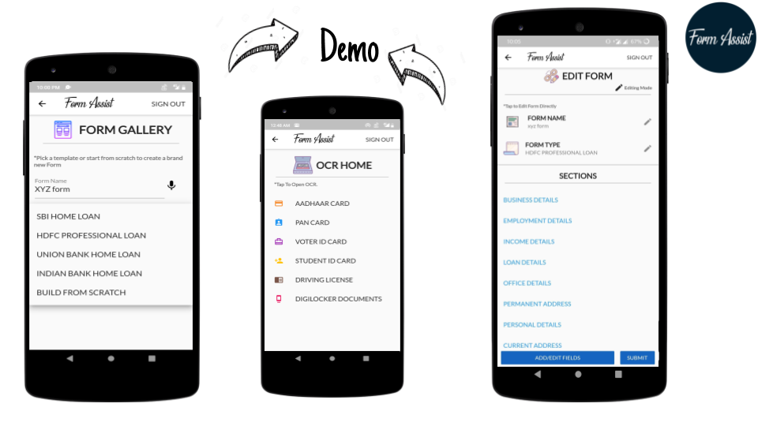

# FormAssist
FormAssist allows users to add data both manually and through third-party integrations which will be stored in the database and can be used in future whenever needed.

## Objective- 
Creating an app to automate the filling of bank forms and to reduce the redundancy in the job on both the sides i.e. on the user as well as bankside to a large extent. The app also tries to support the concept of zero typing to a large extent.

## Screenshots - 
Image 1             |  Image 2
:-------------------------:|:-------------------------:
  |  

## Workflow And Description of the App

1. First, we begin by downloading and installing the app from the play store or any other valid available source. 
2. Then when the installation process is completed we open the app and begin exploring it. The first screen(windows) which appears after successfully installing the app is the Launch screen where the user has been provided with three options:
    * Log-In (if he already has an account with our app.) 
    * Sign -Up(if he is first time user of our app.)
    * Google Sign-In and Google Sign-Up (provided Sign-in and Sign-up facilities via Google Accounts as well.)
3. To make the process faster and typing free we have integrated the page with Speech to Text facilities and in case of Google Sign in only a single tap is required to select the Google Account.
4. After successfully signing in or signing up the user is landed to the home page of the app. The home page provides the user with three facilities which are also the main function of the app:
    * New Form  (to create a new form)
    * Form List (to view, edit, delete and export already created forms)
    * Active Links (generating Form Links)

5. Now if the user wants to make a new form he selects the New Form option and a new screen pops up where the user provides with the name of the form and also selects the kind of template which the user wants to use. In the template selection field the user can select any one of the readymade templates provided smartly by us or he/she can also generate his/her own form by selecting Choose Custom Template. If the user selects Choose Custom Template then a new screen is launched which provides users with the various options of different sections namely Business, Employment, Loan, Permanent Address, etc which the user may want to include in his/her form (although none of the sections has been made mandatory by us since this form is completely user-generated.) and each section has related fields within it. 

6. Now the user selects the sections which he deems necessary for his form and after selecting a particular section he is provided with underlying fields of the section from which he may select any number of fields and confirm the selection of fields by clicking on submit button and if the user wants to unselect some field then a reset button has also been provided. If none of the sections or fields within different sections satisfies users requirements then he can make a completely new field by selecting Others option in the Sections page and give the name of the field (s) and our speech to text converter shall after confirmation from the user there itself will create a new field for the user’s current form which can also be used in other forms as well as it is not deleted but remains save in others section.
7. When the user has added all the required fields in his form he can generate the blueprint of the form by clicking on the Create Form button which would lead the user to his form with the name of the form and all the section names been displayed. The user can then fill-up the form by selecting the different fields from different sections. The user can also edit the name of the form, the details of once filled fields and can also add new fields into the form by selecting Change Form Structure which would redirect the user to the Sections page. 

The user need not type anywhere to fill details since speech to text converter has been provided which would make the app interactive and fast as well. Once all the details are filled the user can click on the Submit button which would finish the process of form creation and addition of details in the form. 
The app redirects the user to the Form List screen where all the previously created forms along with the newly created form are present and the user can his form by just clicking on it which would show the various sections of the form along with the filled values if any. (The user can at any moment edit, add, delete any fields, sections from his form by clicking on edit form button which would redirect the user to the Sections Page where he could do the needful with all the options available in the bottom section of the screen in the form of buttons.)

## OCR 
Our app also provides the utility of prepopulating the user fields in the bank using OCR(Object Character Recognition) which would surely help the user save time as he would just have to upload the photo of his documents(Aadhaar Card, Pan Card, Credit Card) and our indigenous OCR model shall extract features from the image and prepopulate the fields in the form.

## Generating Links
Once a user feels that his form to be forwarded to the bank is ready then he can go to the form list screen from the home page and select his form and click on the Export option which would generate a link of the form pdf in the Active Links screen which is ready to be shared on any of the mediums and the user will also be notified through a mail generated by the Form Assist Database providing the user with a ready to use link of the form.

* * * 

* The user can at any time view his profile by clicking on My Data widget in the home screen.
* The user at no point has to type anything as other modes of taking information have been provided.
* The user at any point of time sign out of the app by clicking on the Sign-Out option provided at the navigation bar and can return to the home page by clicking on the Form Assist icon provided in the same.

# APK and Access Token

This project uses firebase authentication, ML vision and cloud firestore. If you wish to access the production build please email me. :)